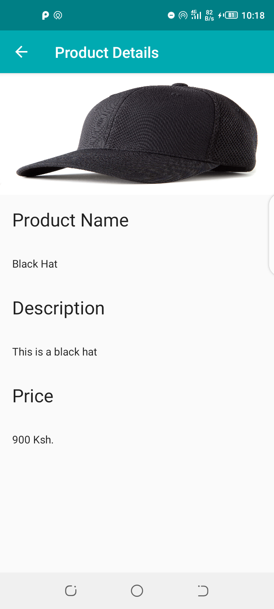

## Databinding 

The application covers general areas on databinding by showcasing databinding in recycler view
adapter,in activities and using a simple case of a binding adapter.

```
Databinding lets you bind UI components in your layouts to data sources in your app using a 
declarative format rather than programmatically.
```         

What this means is you simply tell your layouts the data it will be handling and which view will show
what aspect of the data as compared to using ```findViewById()``` and setting the data to each view
in code.

### Screenshots

 

### Reference

- [DataBinding](https://developer.android.com/topic/libraries/data-binding)


